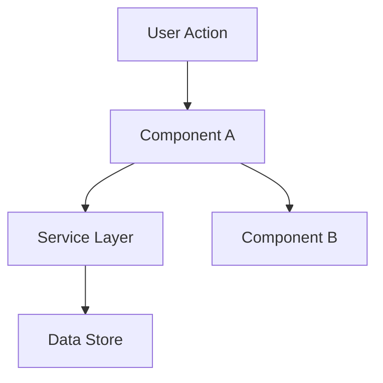

# Plan

**Goal**: Define HOW to build it. Architecture, components, what to reuse.

This is the Plan phase — it resolves the How after Specify locked in the What. Every significant architectural choice made here must be recorded as an ADR before advancing to Tasks. Every Medium/Large/Complex feature must produce at least one C4 diagram.

**Skip this phase when:** The change is straightforward — no architectural decisions, no new patterns, no component interactions to plan. For simple features, design happens inline during Implement.

---

> **SDD contract:** The Plan phase translates the spec's WHAT into an actionable HOW. It produces the design decisions, component map, and interface contracts that make Tasks possible. All significant decisions made here are part of the project's living architecture record — they survive beyond this session via ADRs.

---

## Process

### 1. Load Context

Read `.specs/features/[feature]/spec.md` before planning. If `.specs/features/[feature]/context.md` exists, load it too — it contains implementation decisions that constrain the plan (layout choices, behavior preferences, interaction patterns). Decisions marked as "Agent's Discretion" are yours to decide.

If `.specs/project/CONSTITUTION.md` exists, load it now. Constitution constraints are non-negotiable — the plan must honor them. Any plan that would require violating a constitution constraint MUST surface that conflict to the user before proceeding.

### 1.5. Research (Optional but Recommended)

If the feature involves unfamiliar technology, patterns, or integrations, research before designing. Document findings briefly in the plan doc or as inline notes. This prevents incorrect assumptions from propagating into tasks.

Follow the **Knowledge Verification Chain** (see SKILL.md) in strict order:

```
Codebase → Project docs → Context7 MCP → Web search → Flag as uncertain
```

**CRITICAL: NEVER assume or fabricate information.** If you cannot find an answer through the chain, explicitly say "I don't know" or "I couldn't find documentation for this". Inventing an API, a pattern, or a behavior that doesn't exist is far worse than admitting uncertainty. Wrong assumptions propagate through plan → tasks → implementation and cause cascading failures.

Good triggers for research: new libraries, unfamiliar APIs, performance-sensitive features, security-sensitive features, patterns you haven't used in this codebase before.

### 2. Define Architecture

Overview of how components interact. Use mermaid diagrams when helpful. Before creating any diagrams, check if the `mermaid-studio` skill is available (see Skill Integrations in SKILL.md).

### 2.5. Produce C4 Diagrams (Mandatory for Medium/Large/Complex)

C4 diagrams are a required output of the Plan phase — they are not optional add-ons. Present the following validation checkpoint to the user before generating:

```
Which architecture diagrams do you want for this feature?

1. Context (L1) — always recommended: shows [feature/system] and its external relationships
2. Container (L2) — recommended for new services/APIs: shows runtime components and their interactions
3. Component (L3) — for deep architectural features: shows internal structure of a container
4. Sequence diagram — optional: shows the step-by-step flow for [current feature name]
   (scoped specifically to this feature's execution path, not the full system)

Default: 1 + 2. Select all that apply, or press Enter for the default.
```

Wait for user selection before generating. If the user skips or says "default", produce L1 + L2.

Use **obrigatoriamente** o toolkit `@toolkit/c4-architect` (leia `toolkit/c4-architect/instructions.md`). Para cada nível selecionado:

1. Construa o JSON de entrada conforme os exemplos em `toolkit/c4-architect/examples/`.
2. Passe o JSON pelo engine: `echo '<JSON>' | python3 <toolkit-dir>/scripts/c4_engine.py > docs/architecture/<nome>.puml`
3. Renderize PNG (obrigatório — não pule esta etapa):
   ```bash
   plantuml -tpng docs/architecture/*.puml
   plantuml -tsvg docs/architecture/*.puml
   ```
   Se PlantUML não estiver instalado, instale-o **antes de continuar**: `brew install graphviz plantuml`
4. Referencie cada PNG gerado no `plan.md` com ``

**O toolkit não está completo sem os PNGs gerados.** Não avance para a seção de componentes sem confirmar que os arquivos `.png` existem em `docs/architecture/`.

**The Sequence diagram is always feature-scoped** — it documents the flow triggered by this specific feature, not the entire system. Generate it after the structural diagrams (L1/L2/L3) so the sequence has components to reference.

### 3. Identify Code Reuse

**CRITICAL**: What existing code can we leverage? This saves tokens and reduces errors.

If `.specs/codebase/CONCERNS.md` exists, check it before designing. Any component flagged as fragile, carrying tech debt, or having test coverage gaps requires extra care in the plan — document how the plan mitigates those concerns.

### 4. Define Components and Interfaces

Each component: Purpose, Location, Interfaces, Dependencies, What it reuses.

### 5. Define Data Models

If the feature involves data, define models before implementation.

### 6. Record Architectural Decisions as ADRs (Mandatory)

Before advancing to Tasks, every significant architectural decision made during this Plan phase must be recorded as an ADR. This step is non-negotiable.

**What qualifies as a "significant" decision:**
- Choice of library, framework, or external service
- Structural or layering patterns introduced
- Data model strategy or schema design choices
- Integration approach (sync vs async, REST vs events, etc.)
- Security model or auth approach
- Any choice with long-term consequences or trade-offs

**What does NOT qualify:**
- Variable names, minor formatting, trivial code choices
- Decisions that are purely implementation details with no architectural impact

For each significant decision, create an ADR using the format in `toolkit/create-adr/instructions.md`. Place ADRs in `docs/adr/`.

**Rule:** Do not advance from Plan to Tasks if a significant architectural decision was made and not yet recorded as an ADR.

---

## Template: `.specs/features/[feature]/plan.md`

````markdown
# [Feature] Plan

**Spec**: `.specs/features/[feature]/spec.md`
**Status**: Draft | Approved

---

## Architecture Overview

[Brief description of the architecture approach]



---

## Architecture Diagrams

### Context (L1)


### Container (L2) *(if selected)*


### Component (L3) *(if selected)*


### Sequence: [Feature Name] *(if selected)*


---

## Code Reuse Analysis

### Existing Components to Leverage

| Component            | Location            | How to Use                |
| -------------------- | ------------------- | ------------------------- |
| [Existing Component] | `src/path/to/file`  | [Extend/Import/Reference] |
| [Existing Utility]   | `src/utils/file`    | [How it helps]            |
| [Existing Pattern]   | `src/patterns/file` | [Apply same pattern]      |

### Integration Points

| System         | Integration Method                      |
| -------------- | --------------------------------------- |
| [Existing API] | [How new feature connects]              |
| [Database]     | [How data connects to existing schemas] |

---

## Components

### [Component Name]

- **Purpose**: [What this component does - one sentence]
- **Location**: `src/path/to/component/`
- **Interfaces**:
  - `methodName(param: Type): ReturnType` - [description]
  - `methodName(param: Type): ReturnType` - [description]
- **Dependencies**: [What it needs to function]
- **Reuses**: [Existing code this builds upon]

---

## Data Models (if applicable)

### [Model Name]

```typescript
interface ModelName {
  id: string
  field1: string
  field2: number
  createdAt: Date
}
```

**Relationships**: [How this relates to other models]

---

## Error Handling Strategy

| Error Scenario | Handling      | User Impact      |
| -------------- | ------------- | ---------------- |
| [Scenario 1]   | [How handled] | [What user sees] |
| [Scenario 2]   | [How handled] | [What user sees] |

---

## Tech Decisions (only non-obvious ones)

| Decision          | Choice          | Rationale     | ADR           |
| ----------------- | --------------- | ------------- | ------------- |
| [What we decided] | [What we chose] | [Why - brief] | [ADR-NNN link] |

---

## ADRs Created

| ADR | Decision | Status |
| --- | -------- | ------ |
| [ADR-NNN](docs/adr/NNN-*.md) | [What was decided] | Accepted |

````

---

## Tips

- **Load context first** — If context.md exists, decisions there are locked
- **Check CONSTITUTION.md** — Constitution constraints are non-negotiable; surface conflicts before continuing
- **Research when uncertain** — 5 minutes of research prevents hours of rework
- **Reuse is king** — Every component should reference existing patterns
- **C4 before components** — Produce architecture diagrams before writing the component list; diagrams reveal structure, components fill in detail
- **Interfaces first** — Define contracts before implementation
- **Keep it visual** — Diagrams save 1000 words (check mermaid-studio skill in Skill Integrations)
- **Small components** — If component does 3+ things, split it
- **Check CONCERNS.md** — If it exists, flag fragile areas the plan must address
- **ADRs are mandatory** — Every significant architectural decision must be recorded before advancing to Tasks
- **Sequence = feature scope** — Sequence diagrams document this feature's flow only, not the full system
- **Plan is a phase gate** — User MUST approve plan.md before Tasks proceeds. This is the SDD phase gate. Approval means: "I agree this is how we're building it." Once approved, the plan is frozen — changes require going back to this gate
- **Confirm before Tasks** — User approves plan before breaking into tasks
